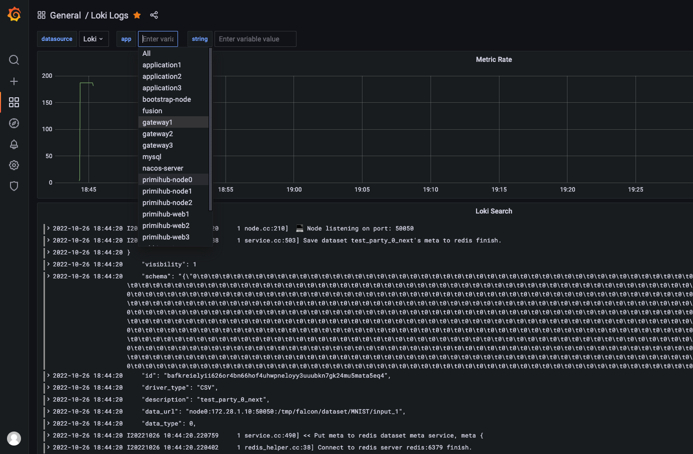

# readme

## 安装

使用 `Loki` 来收集容器日志时，需要先安装 `loki` 的 `docker plugin`

```shell
docker plugin install grafana/loki-docker-driver:latest --alias loki --grant-all-permissions
```

然后配置手机所有docker容器的日志，一定主要将下面的 `YOUR_IP` 替换成你机器的内网IP
```shell
# vim /etc/docker/daemon.json  添加以下内容
{
  "log-driver": "loki",
  "log-opts": {
    "loki-url": "http://YOUR_IP:3100/loki/api/v1/push",
    "max-size": "50m",
    "max-file": "10"
  }
}
```

配置好之后重启docker服务
```
systemctl restart docker
```
然后启动 `loki`
```
docker-compose up -d
```
最后到上级目录启动项目

## 配置Grafana

启动完成之后，配置 `Grafana`

在浏览器访问  `http://YOUR_IP:3000` ,默认用户密码是 `admin` 和 `admin`,第一次登录时需要将密码修改为你自己的密码

#### 添加loki数据源

1. 找到左边的设置按钮 -> 点击Data Source -> Add data sourve -> 选择第5个 Loki
2. 配置 HTTP URL，就填写 `http://loki:3100`, 别的都不用管
3. 点击最下面的 Save & Test, 提示连接成功则没问题
4. 点击最左边的加号 -> 选择Import -> 点击 Upload JSON file -> 选择当前目录下的Loki-Logs.json -> 最下面的数据源选择Loki，点击Import 
5. 最后打开Dashboards，效果如下

